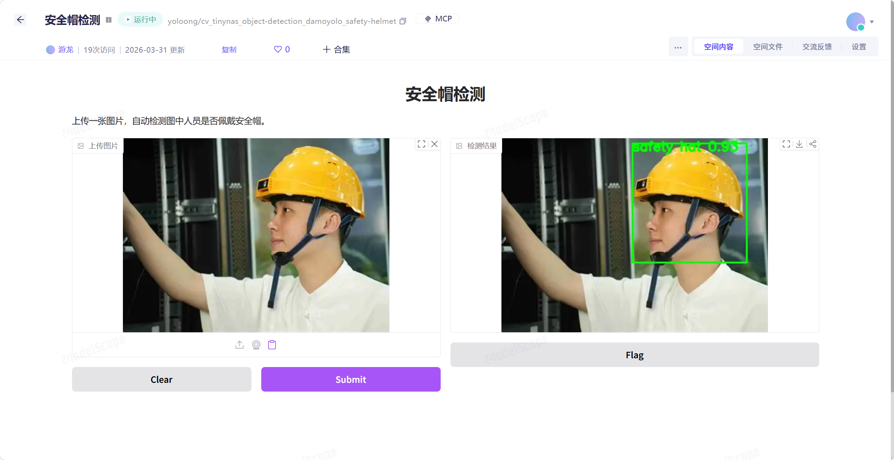

# ModelScope 创空间复现：安全帽检测

[](https://modelscope.cn/)
[](https://www.gradio.app/)
[](https://www.python.org/)
[](./LICENSE)

[English Version](./README.en.md)

基于 **ModelScope（魔搭社区）创空间** 环境整理的安全帽检测可部署示例项目。  
本项目使用 **ModelScope + Gradio + OpenCV**，实现对图片中人员是否佩戴安全帽的目标检测，并返回可视化检测结果。

---

## 项目简介

这是一个面向 **ModelScope 创空间** 的安全帽检测 Demo，核心基于 ModelScope 提供的安全帽检测模型：

- 模型：`damo/cv_tinynas_object-detection_damoyolo_safety-helmet`

支持以下流程：

1. 上传图片
2. 自动加载模型并执行检测
3. 绘制检测框、类别标签和置信度
4. 返回结果图像

本仓库适用于：

- ModelScope 创空间部署实践
- 安全帽检测项目复现
- Gradio 图像检测示例
- 本地调试 + 云端部署案例

---

## 项目徽章说明

- **ModelScope Space**：目标部署平台
- **Gradio 6.2.0**：前端交互框架
- **Python 3.11**：推荐本地运行版本
- **Apache 2.0**：项目开源许可证

---

## 效果展示



可展示内容建议：

- 上传测试图片后的识别结果
- 检测框、标签、置信度显示效果
- 创空间页面运行截图

---

## 环境适配

本版本按 **魔搭社区创空间** 环境进行了适配，推荐配置如下：

- **SDK**：`gradio`
- **Gradio 版本**：`6.2.0`
- **镜像版本**：`ubuntu22.04-py311-torch2.9.1-modelscope1.35.0`
- **云资源**：免费 CPU

---

## 项目结构

```text
.
├── app.py
├── requirements.txt
├── README.md
└── README.en.md
```

文件说明：

- `app.py`：主程序，包含模型加载、推理与 Gradio 界面
- `requirements.txt`：依赖列表
- `README.md`：中文说明文档
- `README.en.md`：英文说明文档

---

## 核心实现

本项目保留了安全帽检测任务中的典型推理结构：

- `pipeline(Tasks.domain_specific_object_detection, model=...)`
- `OutputKeys.SCORES / LABELS / BOXES`
- `cv2.rectangle(...)`
- `cv2.putText(...)`

同时，为适配创空间与 Gradio 6.2.0，本项目采用了更稳的写法，并在云端无桌面环境中使用：

- `opencv-python-headless`

---

## 快速开始

### 1. 克隆仓库

```bash
git clone https://github.com/XXYoLoong/Safety-Helmet-Detection-Modelscope.git
cd Safety-Helmet-Detection-Modelscope
```

### 2. 创建虚拟环境

#### Windows

```bash
py -3.11 -m venv .venv
.venv\Scripts\activate
```

#### macOS / Linux

```bash
python3.11 -m venv .venv
source .venv/bin/activate
```

### 3. 安装依赖

```bash
pip install -r requirements.txt
```

### 4. 本地运行

```bash
python app.py
```

启动后访问：

```text
http://127.0.0.1:7860
```

---

## 部署到 ModelScope 创空间

### 1. 新建创空间
在魔搭社区新建一个创空间项目。

### 2. 配置环境
请按以下配置选择：

- SDK = `gradio`
- Gradio 版本 = `6.2.0`
- 镜像 = `ubuntu22.04-py311-torch2.9.1-modelscope1.35.0`

### 3. 上传文件
将以下文件上传到仓库根目录：

- `app.py`
- `requirements.txt`
- `README.md`
- `README.en.md`

### 4. 发布创空间
上传完成后发布创空间并等待构建完成。

### 5. 访问应用
构建成功后即可访问并使用安全帽检测应用。

---

## 首次运行说明

首次运行时会自动下载模型：

```text
damo/cv_tinynas_object-detection_damoyolo_safety-helmet
```

因此第一次推理通常会较慢，属于正常现象。

---

## 本地调试建议

强烈建议 **先在本地运行成功，再上传创空间**。

原因如下：

- 上传代码后，并不会立刻出现完整可交互界面
- 通常需要发布创空间后，才能看到真实执行结果
- 如果部署失败，主要依赖失败日志定位问题
- 在线排错成本明显高于本地调试

建议本地先验证：

- 依赖可正常安装
- 模型能够成功加载
- 图片上传与推理流程可用
- 结果图像能够正常返回

---

## 常见错误排查

### 1. 上传后看不到完整检测功能

**现象：**
上传代码后页面没有“开始检测”或没有完整可操作界面。

**原因：**
创空间上传文件不等于应用已经运行成功，通常必须发布后才能看到真实运行结果。

**解决方法：**
先发布创空间，再查看运行状态与日志。更推荐先本地跑通后再上传。

---

### 2. `numpy` / `scipy` 版本冲突

**现象：**
启动时出现 `binary incompatibility`、`dtype size changed` 等报错。

**原因：**
`numpy` 与 `scipy` 版本不兼容。

**解决方法：**
锁定依赖版本，避免自动安装到不兼容版本。

---

### 3. 缺少 `easydict`

**现象：**
模型加载时报 `No module named 'easydict'`。

**原因：**
TinynasDetectionPipeline 依赖 `easydict`。

**解决方法：**
在 `requirements.txt` 中加入：

```txt
easydict==1.13
```

---

### 4. 缺少 `trust_remote_code=True`

**现象：**
模型初始化时报错，提示需要 `trust_remote_code`。

**原因：**
该模型需要执行模型仓库中的额外代码。

**解决方法：**
在 `pipeline(...)` 中显式加入：

```python
trust_remote_code=True
```

---

### 5. 本地 Python 版本过高导致依赖安装失败

**现象：**
在 Windows 本地安装 `scipy` 时触发源码编译，并出现 Fortran 编译器缺失。

**原因：**
使用了过新的 Python 版本，例如 3.14。

**解决方法：**
推荐使用：

- Python 3.10
- Python 3.11

本项目更推荐 **Python 3.11**。

---

## 依赖建议

建议锁定如下依赖版本：

```txt
gradio==6.2.0
modelscope==1.35.0
numpy==1.26.4
scipy==1.11.4
opencv-python-headless==4.10.0.84
pillow==10.4.0
easydict==1.13
```

---

## License

本项目采用 [Apache License 2.0](./LICENSE) 开源许可证。

---

## Acknowledgements

感谢 ModelScope（魔搭社区）提供模型、数据集与创空间支持。

如果你也在使用 ModelScope（魔搭社区），欢迎访问我的个人主页交流互关：  
**https://modelscope.cn/profile/yoloong**
